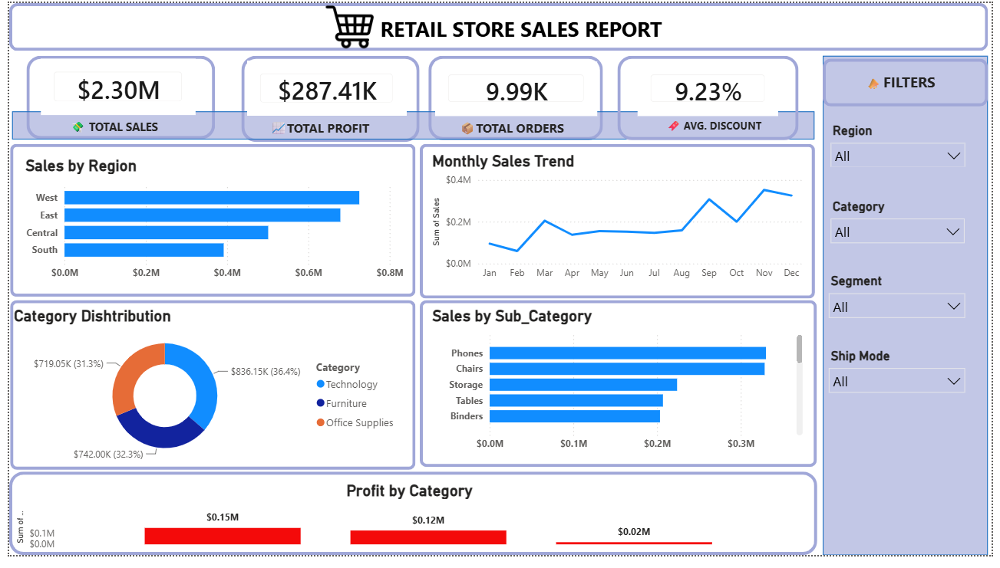
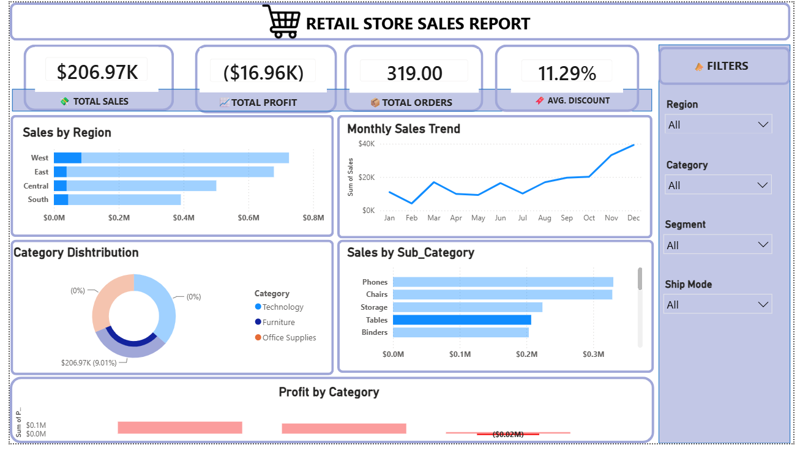
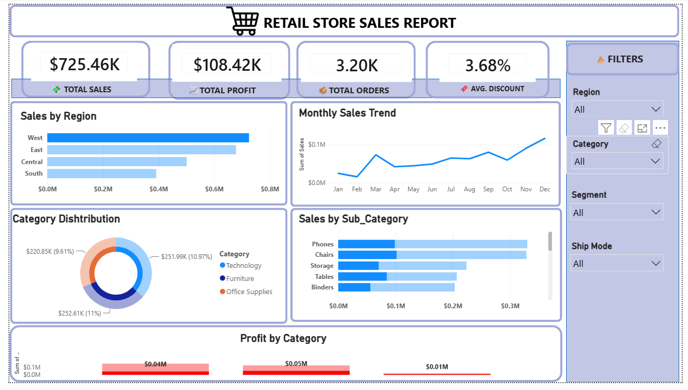

# Retail Store Sales Analysis Dashboard

## Project Overview

This project presents an interactive **Retail Store Sales Dashboard** developed in **Microsoft Power BI** using the Sample Superstore dataset.

The dashboard is designed to analyze overall business performance and provide insights into sales, profitability, orders, discounts, regional performance, product categories, sub-categories, and monthly sales trends.

## Dashboard Preview



## Key Performance Indicators

The dashboard tracks four primary KPIs:

- **Total Sales:** $2.30M
- **Total Profit:** $287.41K
- **Total Orders:** 9.99K
- **Average Discount:** 9.23%

## Business Questions

The analysis was designed to answer questions such as:

- Which regions generate the highest sales?
- How do sales change throughout the year?
- Which product categories contribute the most revenue?
- Which sub-categories generate the highest sales?
- How does profitability differ across product categories?
- How do Region, Category, Segment, and Ship Mode affect performance?

## Dashboard Features

### Sales by Region
Compares sales performance across the West, East, Central, and South regions.

### Monthly Sales Trend
Tracks sales from January through December to identify changes in monthly performance.

### Category Distribution
Shows the contribution of Technology, Furniture, and Office Supplies to overall sales.

### Sales by Sub-Category
Compares sales across product sub-categories such as Phones, Chairs, Storage, Tables, and Binders.

### Profit by Category
Analyzes profitability across the major product categories.

### Interactive Filters
The dashboard includes slicers for:

- Region
- Category
- Segment
- Ship Mode

These filters allow users to dynamically explore different sections of the business.

## Key Insights

- The **West region** generates the highest overall sales.
- **Technology** is the largest category by sales.
- **Phones and Chairs** are among the strongest-performing sub-categories.
- Profitability varies significantly between product categories.
- Interactive filtering reveals that some business segments can generate **negative profit despite positive sales**, highlighting the importance of analyzing profitability alongside revenue.
- Monthly sales performance varies throughout the year, with stronger sales visible toward the later months in the overall dataset.

## Tools & Skills

- Microsoft Power BI
- Power Query
- DAX
- Data Cleaning
- Data Transformation
- Data Visualization
- Dashboard Design
- Business Intelligence
- Data Analysis

## Dataset

The project uses the **Sample Superstore** dataset containing retail transaction information including:

- Orders
- Sales
- Profit
- Discounts
- Product categories and sub-categories
- Customer segments
- Regions
- Shipping modes
- Order dates

## Project Structure

```text
retail-store-sales-powerbi-dashboard/
├── README.md
├── dashboard/
│   └── Retail_Store_Sales_Dashboard.pbix
├── data/
│   └── Sample_Superstore_Dataset.xlsx
└── images/
    ├── retail-store-sales-dashboard.png
    ├── dashboard-filtered-view-1.png
    └── dashboard-filtered-view-2.png
```

## Interactive Analysis

The dashboard supports dynamic filtering across multiple business dimensions.

### Example Filtered View



### Negative Profit Scenario



The filtered views demonstrate how the dashboard can be used to investigate specific business segments and identify differences in sales and profitability.

## Author

** Altamash Khan **

Data Analyst | Power BI | SQL | Excel | Data Visualization

## Feedback

Feedback and suggestions for improving this project are welcome.
